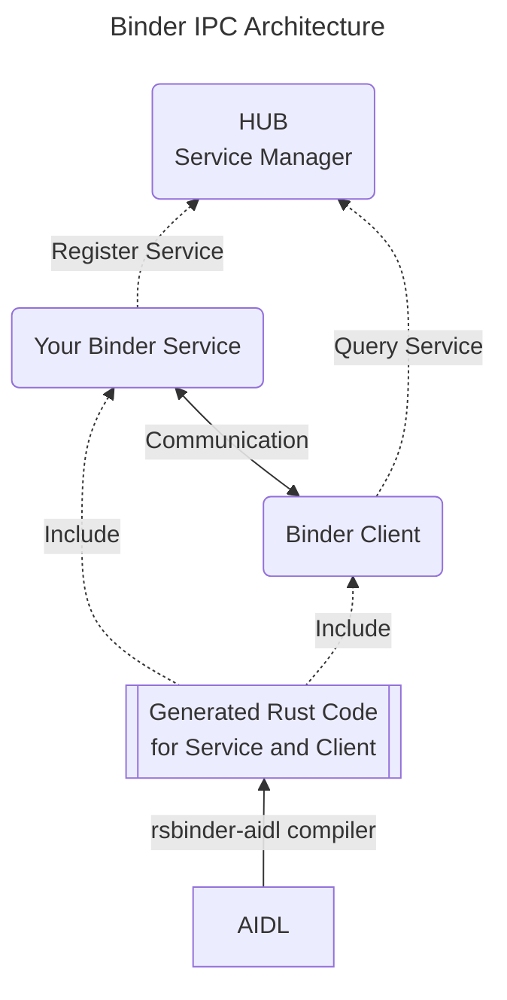

# Architecture

### Description of each component of the diagram
- AIDL
    - The Android Interface Definition Language (AIDL) is a tool that lets users abstract away IPC. Given an interface (specified in a .aidl file), various build systems use the **rsbinder-aidl** crate to construct Rust bindings so that this interface can be used across processes, regardless of the runtime or bitness there.
    - [https://source.android.com/docs/core/architecture/aidl](https://source.android.com/docs/core/architecture/aidl)
- Your Binder Service
    - Include the Rust code generated from AIDL to create your service.
    - Use rsbinder::hub to register your service with the HUB and wait for client requests.
- Binder Client
    - Use the Rust code generated from AIDL to communicate with the service.
    - Query the HUB to check if the required service is available and receive a Binder Object (rsbinder::SIBinder) for the service.
    - Use the Binder Object to communicate with the Binder Service.
- HUB(Service Manager)
    - rsbinder provides **rsb_hub**, a service manager for Linux.
    - On Android, no additional work is required since the Android service manager is already running.

